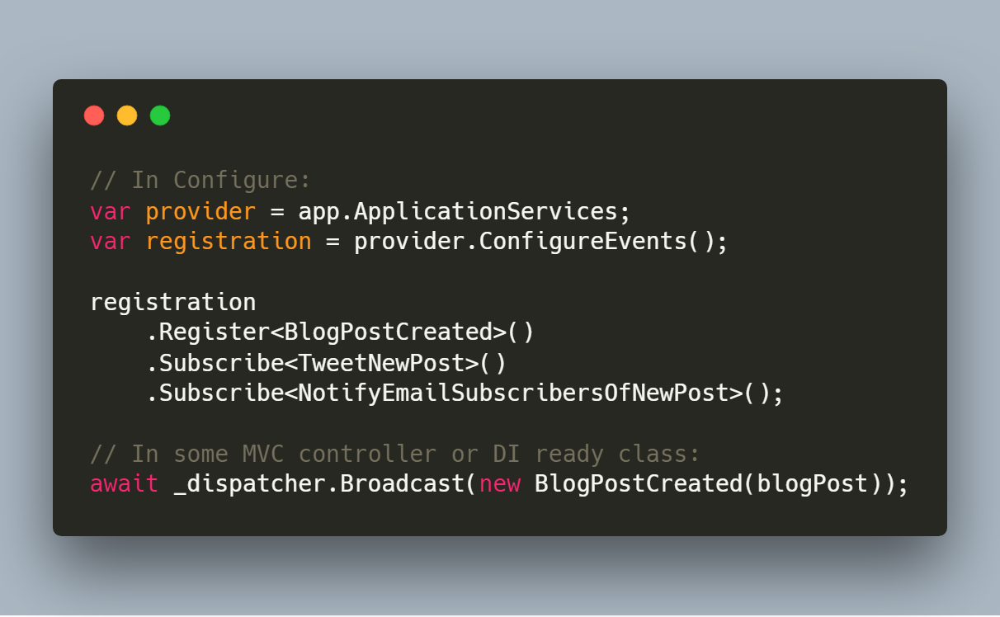

# Events

Coravel's events allow you to subscribe and listen to events that occur in your application. This is a great way to build maintainable applications who's parts are loosely coupled.

An event will have one or more independent listeners which, when an event is broadcasted, will be "given" the broadcasted event. The listeners can then independently perform their specific application logic based on the event's data.

## Example: Broadcasting A New Blog Post To The Public

For example, you might have a .NET Core application that has a blog built into it. You want to add a feature that sends a twitter tweet and an e-mail updating your social network about any new posts you add to your blog:



## Configuring Events

In your startup file, in the `ConfigureServices` method:

```c#
services.AddEvents();
```

> In version 1.9 `ConfigureEvents` was moved as an extension method of `IServiceProvider`.
> This allows Coravel's dependencies to be significantly slimmed down 👌

Next, in the `Configure` method call `ConfigureEvents` off of the service provider:

```c#
var provider = app.ApplicationServices;
IEventRegistration registration = provider.ConfigureEvents();
```

Now you can start registering events and their listeners:

```c#
registration
	.Register<BlogPostCreated>()
	.Subscribe<TweetNewPost>()
  	.Subscribe<NotifyEmailSubscribersOfNewPost>();
```

## Creating An Event

Creating an event is simple.

Create a class that implements the interface `Coravel.Events.Interfaces.IEvent`. That's it!

An event is merely a data object that will be supplied to each listener. It should expose data that is associated with this specific event.

For example, a `BlogPostCreated` event should accept the `Blog` that was created and then expose it via a public property.

```c#
public class BlogPostCreated : IEvent
{
    public BlogPost Post { get; set; }

    public BlogPostCreated(BlogPost post)
    {
        this.Post = post;
    }
}
```

## Creating A Listener

Create a new class that implements the interface `Coravel.Events.Interfaces.IListener<TEvent>` - where `TEvent` is the event that you will be listening to.

> _Note: Each listener can only be associated with one event - since the event will be passed in the `HandleAsync` method._

The `IListener<TEvent>` interface requires you implement `HandleAsync(TEvent broadcasted)`.

Using the example of the new blog post event, we might create a listener named `TweetNewPost`:

```c#
// The IListener generic parameter is the event
// that you will be listening to.
public class TweetNewPost : IListener<BlogPostCreated>
{
    private TweetingService _tweeter;

    public TweetNewPost(TweetingService tweeter){
        this._tweeter = tweeter // Injected via service container
    }

    public async Task HandleAsync(BlogPostCreated broadcasted)
    {
        var post = broadcasted.Post; // Post is a public property of the event.
        await this._tweeter.TweetNewPost(post);
    }
}
```

Finally, **you must register your listener with the service container** by using `AddTransient` or `AddScoped`.

## Generate Events And Listeners Using Coravel's CLI

You can let Coravel generate events and listeners for you!

See the [CLI docs](./Cli.md) for more information.

## Broadcasting Events

### Basic Broadcasting

To broadcast events, Coravel supplies the `Coravel.Events.Interfaces.IDispatcher` interface.

You can inject an instance into your MVC controllers or other DI ready classes.

By using the `Broadcast` method, you may broadcast a new event.

```c#
public BlogController : Controller
{
    private IDispatcher _dispatcher;

    public BlogController(IDispatcher dispatcher)
    {
        this._dispatcher = dispatcher;
    }

    public async Task<IActionResult> NewPost(BlogPost newPost)
    {
        var postCreated = new BlogPostCreated(newPost);
        await _dispatcher.Broadcast(postCreated); // All listeners will fire.
    }
}
```

### Queuing An Event To Be Broadcasted

You may queue events that will be broadcasted in the background of your running app.

See the docs for [Queue Event Broadcasting](Queuing.md#queue-event-broadcasting).
